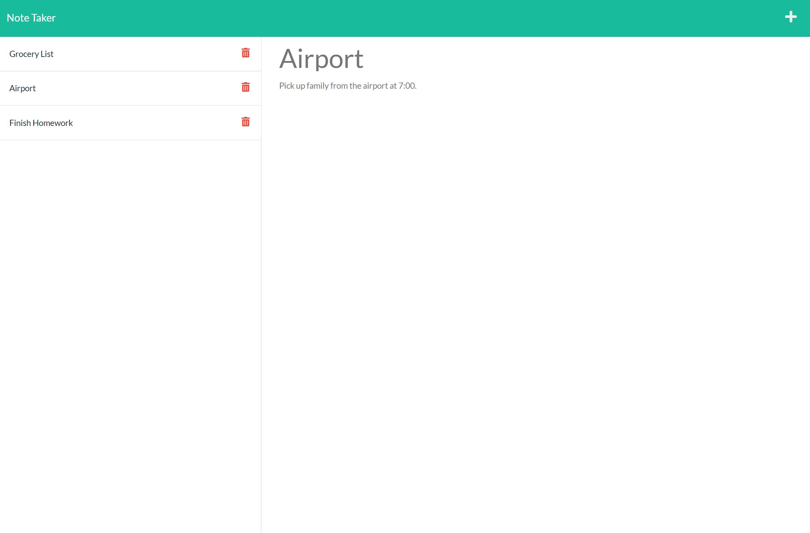

# Note Taker using Express.js
  
  [
    
    ](https://choosealicense.com/)
  
  ## Table of Contents
  * [Description](#description)
  * [Installation](#installation)
  * [Usage](#usage)
  * [Contribution Guidelines](#contribution-guidelines)
  * [Testing](#testing)
  * [Questions](#questions) 
    
  ## Description
  This is a simple note taking app using the express.js package in Node.js. It creates notes with a title and a body of text that the user can create and delete at will.
  ## Installation
  Node.js runtime is required for this app, as well as express.js and uuid. The command 'npm init' should be run to install dependecies.
  ## Usage
  To start the server, the user must type 'npm start' in the command line and navigate to the localhost webpage with the specified port(usually 3001).
  ## Contribution Guidelines
  This repo is not currently accepting contributions.
  ## Testing
  Testing was not required for this app.
  ## Questions
  * GitHub: [jd-rowley](http://github.com/jd-rowley)
  * E-mail: jdrowley1989@gmail.com

  ## Page Screenshot
  
